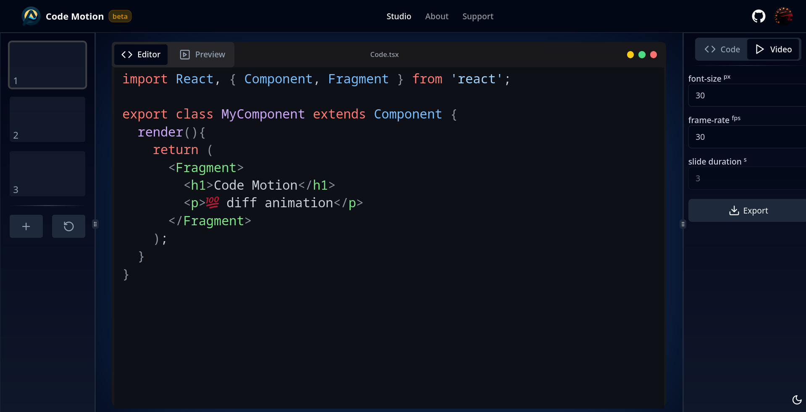

<div align="center">
  <h2>
    An effortless video code diff-animation tool for visualizing code changes
  </h2>
</div>

<div align="center">
  <figure>
    <a href="https://code-motion.vercel.app/" target="_blank" rel="noopener">
			
		</a>
    <figcaption>
      <p align="center">
        Present your code like never before.
      </p>
    </figcaption>
  </figure>
</div>

## Features

- 💯 Free & open-source
- 🤩 diff animation ([example](https://code-motion.vercel.app/assets/diff-anim-example-CQZ8pw7x.webm))
- 🏗️ canvas-based video
- 🎬 preview player
- 🖼️ Export video to webm
- ✍️ in-browser code editor
- 🎨 Customizable
- 📷 capture screenshots
- 🌓 Dark mode

## Use Cases

- Creating programming video tutorials (youtube, udemy..).
- Assisting tutors in explaining code solutions effectively.
- Student showcasing specific code snippets during presentation.  
  ...

## Developing

Clone the repository, then you can run it locally or in a docker container

### locally

> [!TIP]
> Install pnpm [`npm i -g pnpm`] if not already installed

1. Install the dependencies

   ```sh
   pnpm run install
   ```

2. Run the app locally

   ```sh
   pnpm run dev
   ```

### Docker

1. Pull the image and run the container

   ```sh
   docker-compose up
   ```

After running the app either locally or in docker, navigate to http://localhost:5173.

## Tech Stack

- TypeScript : A statically typed superset of JavaScript, for better DX
- React : A library for building user interfaces using components
- Tailwind : A utility-first CSS framework for rapid web development
- Zustand : A lightweight state management library for React
- Framer-Motion : A production-ready animation library for React
- Shadcn : A set of pre-designed ui components, accessible. customizable.
- CodeMirror : A code editor component for the web.
- DiffJs : A text differencing implementation based on the O(ND)Algorithm.
- PrismJs : A syntax highlighting library for code blocks
- Clerk : A third sevice to simplify the authentication

## Privacy

App is designed to be offline-first, meaning that it does not rely on any external servers or backdoors,  
and soon i will remove the needs to sign-in (for now use demo acc, user: test pwd: 1234).

However, code motion utilizes Vercel Basic Analytics:  
but only stores anonymized data, and does not use cookies [more info](https://vercel.com/docs/analytics#how-visitors-are-determined)

## Contributing

- Found a bug? [Report here](https://github.com/amasin76/code-motion/issues/new/choose).
- Feature missing? [Request here](https://github.com/amasin76/code-motion/issues/new/choose).

## Like Code Motion?

Don't forget to star the repository! ⭐️
